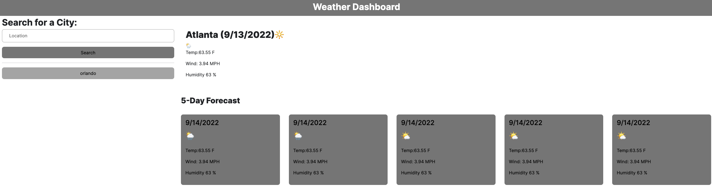

# weather_dashboard

# Description

This is a weather dashboard created to show users the current weather conditions of a specific city.

- Help you assess weather risks at a specific location.
- Detailed data about the weather in a beautiful design.

## Example

## Links

For access to deployed website [Click Here](https://parryprogramming.github.io/weather_dashboard/)